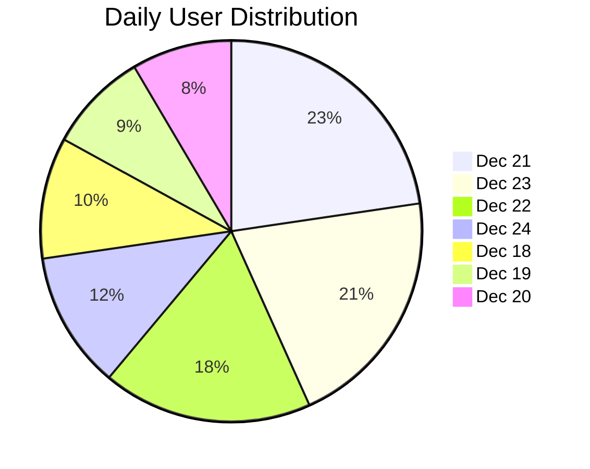
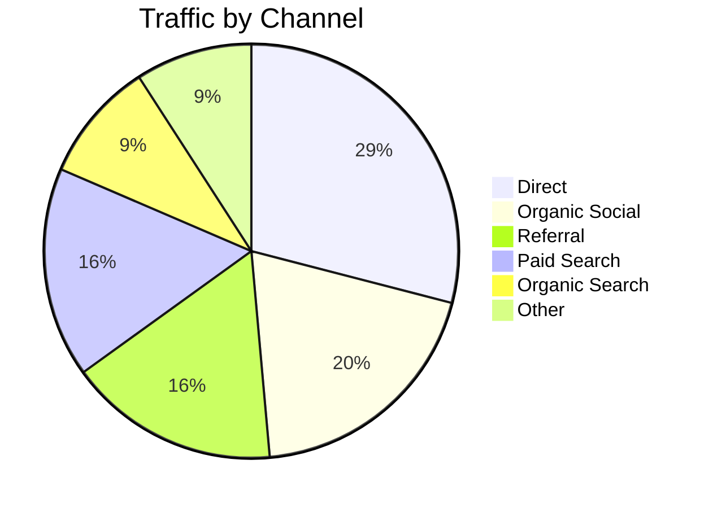
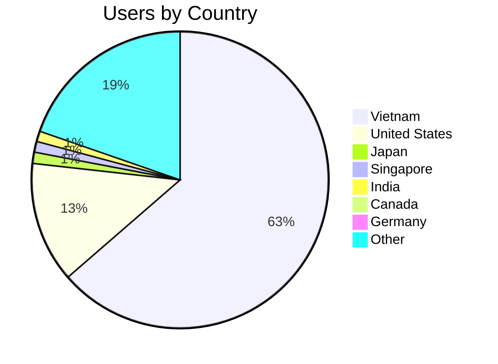

# ClaudeKit.cc Analytics Report

**Period:** Dec 18-24, 2025 (7 days)
**Property:** ClaudeKit.cc (GA4 509126475)
**Generated:** Dec 25, 2025

---

## Executive Summary

| Metric | Value | Trend |
|--------|-------|-------|
| Active Users | **5,714** | Strong |
| Sessions | **7,857** | High engagement |
| Page Views | **25,422** | 3.2 pages/session |
| New Users | **3,878** | 67.8% new |
| Avg Session Duration | **4m 52s** | Good retention |
| Bounce Rate | **44%** | Acceptable |
| Conversions | **550** | Checkout events |

### Key Highlights

- **Peak Day:** Dec 21 with 1,295 users, 1,720 sessions
- **Top Traffic Source:** Direct (1,659 users) + Google (1,351 users)
- **Primary Market:** Vietnam (63%), USA (13%)
- **Device Split:** Desktop 62%, Mobile 36%
- **Hot Product Interest:** Engineer Kit (1,279 clicks) > Marketing Kit (954) > Combo (804)

---

## Daily Traffic Trend

```
Date       | Users | Sessions | Pageviews | Bounce | Avg Duration
-----------|-------|----------|-----------|--------|-------------
Dec 21     | 1,295 | 1,720    | 8,674     | 31.0%  | 8m 24s
Dec 23     | 1,178 | 1,541    | 3,635     | 32.2%  | 3m 40s
Dec 22     | 1,017 | 1,436    | 4,822     | 33.8%  | 6m 14s
Dec 24     | 664   | 929      | 2,130     | 92.7%* | 6m 11s
Dec 18     | 588   | 875      | 3,366     | 37.5%  | 5m 05s
Dec 19     | 487   | 681      | 1,480     | 49.2%  | 3m 20s
Dec 20     | 485   | 675      | 1,315     | 50.2%  | 2m 18s
```

*Dec 24 anomaly: Christmas Eve traffic drop with unusually high bounce

### Traffic Pattern



---

## Acquisition Channels



| Channel | Users | Sessions | Pageviews | Conversions | CVR |
|---------|-------|----------|-----------|-------------|-----|
| Direct | 1,659 | 2,299 | 7,860 | 199 | 8.7% |
| Organic Social | 1,117 | 1,527 | 3,162 | 72 | 4.7% |
| Referral | 941 | 1,606 | 5,151 | 90 | 5.6% |
| Paid Search | 938 | 1,368 | 5,260 | 103 | 7.5% |
| Organic Search | 538 | 873 | 3,039 | 64 | 7.3% |
| Unassigned | 379 | 430 | 657 | 14 | 3.3% |
| Cross-network | 84 | 84 | 221 | 3 | 3.6% |
| Organic Video | 6 | 11 | 67 | 5 | 45.5% |

### Key Sources Breakdown

| Source | Users | Sessions | Notes |
|--------|-------|----------|-------|
| (direct) | 1,659 | 2,299 | Brand awareness |
| google | 1,351 | 2,125 | Paid + Organic |
| leadsgo.io | 501 | 501 | Affiliate referral |
| m.facebook.com | 457 | 509 | Mobile social |
| l.facebook.com | 404 | 705 | Desktop social link |
| accounts.google.com | 179 | 517 | OAuth redirects |
| github.com | 141 | 291 | Dev community |
| t.co | 98 | 113 | Twitter/X |
| vividkit.dev | 48 | 82 | Related product |
| polar.sh | 35 | 61 | Payment partner |

### New User Acquisition

| Source | New Users | % of Total |
|--------|-----------|------------|
| (direct) | 1,483 | 38.2% |
| google | 820 | 21.1% |
| leadsgo.io | 501 | 12.9% |
| m.facebook.com | 422 | 10.9% |
| l.facebook.com | 228 | 5.9% |
| t.co (Twitter) | 88 | 2.3% |
| Other | 336 | 8.7% |

---

## Top Pages Performance

| Page | Views | Users | Avg Duration | Bounce |
|------|-------|-------|--------------|--------|
| / (Home) | 12,765 | 4,681 | 3m 23s | 38.0% |
| /engineer | 2,837 | 1,273 | 3m 50s | 26.3% |
| /account/dashboard | 2,805 | 536 | 4m 25s | 18.6% |
| /account/login | 1,070 | 793 | 1m 16s | 11.4% |
| /account/orders | 897 | 362 | 1m 10s | 9.8% |
| /marketing | 580 | 382 | 2m 11s | 24.0% |
| /checkout/sepay | 556 | 294 | 2m 24s | 2.8% |
| /account/commissions | 533 | 206 | 2m 56s | 8.6% |
| /account/payouts | 517 | 263 | 53s | 8.9% |
| /blog | 474 | 341 | 1m 28s | 15.9% |

### Page Insights

- **Homepage** dominates with 50% of pageviews; good engagement (3m 23s avg)
- **Engineer Kit** outperforms Marketing Kit (2,837 vs 580 views)
- **Checkout funnel** shows healthy progression: sepay (556) → loyalty (367) → success (244)
- **Dashboard/account** pages show strong user retention (low bounce)
- **Blog** getting traction; 474 views across articles

### Blog Performance

| Article | Views | Users |
|---------|-------|-------|
| vc-07-claude-code-common-mistakes | 62 | 57 |
| new-video-getting-started | 57 | 49 |
| vc-01-first-steps-using-sub-agents | 20 | 16 |
| context-engineering-how-to-turn-ai | 14 | 12 |
| vc-04-subagents-from-basic-to-deep | 12 | 11 |

---

## Geographic Distribution



| Country | Users | Sessions | % Share |
|---------|-------|----------|---------|
| Vietnam | 3,578 | 6,098 | 62.6% |
| United States | 740 | 798 | 12.9% |
| Japan | 69 | 111 | 1.2% |
| Singapore | 66 | 86 | 1.2% |
| India | 64 | 82 | 1.1% |
| Canada | 50 | 71 | 0.9% |
| Germany | 40 | 47 | 0.7% |
| Australia | 27 | 34 | 0.5% |
| South Korea | 27 | 58 | 0.5% |
| France | 26 | 45 | 0.5% |

**73 countries** reached globally

---

## Device & Technology

### Device Category

| Device | Users | Sessions | Pageviews | % Users |
|--------|-------|----------|-----------|---------|
| Desktop | 3,117 | 5,208 | 19,557 | 62.8% |
| Mobile | 1,814 | 2,482 | 5,802 | 36.6% |
| Tablet | 29 | 31 | 49 | 0.6% |
| Smart TV | 6 | 6 | 14 | 0.1% |

### Operating System

| OS | Users | Sessions | % Users |
|----|-------|----------|---------|
| Macintosh | 1,555 | 2,827 | 31.4% |
| Windows | 1,380 | 2,211 | 27.8% |
| iOS | 990 | 1,440 | 20.0% |
| Android | 850 | 1,073 | 17.1% |
| Linux | 181 | 275 | 3.6% |

**Insight:** Strong developer audience (Mac + Linux = 35%)

---

## Key Events & Conversions

| Event | Count | Per User | Notes |
|-------|-------|----------|-------|
| page_view | 25,422 | 5.18 | Core metric |
| user_engagement | 11,977 | 3.47 | Quality signal |
| session_start | 7,797 | 1.60 | Entry points |
| scroll | 6,142 | 2.92 | Content engagement |
| code_hunt_modal_opened | 5,797 | 4.28 | Easter egg feature |
| first_visit | 3,878 | 1.00 | New users |
| **purchase_click** | 3,037 | 2.96 | Intent signal |
| form_start | 2,101 | 2.28 | Lead capture |
| engineer_kit_purchase_click | 1,279 | 2.22 | Product interest |
| marketing_kit_purchase_click | 954 | 2.31 | Product interest |
| combo_purchase_click | 804 | 2.39 | Bundle interest |
| **checkout** | 550 | 1.88 | Transaction intent |
| easter_egg_unlocked | 191 | 3.08 | Gamification works |

### Conversion Funnel

```
Purchase Clicks: 3,037 (53% of users)
    ↓
Checkout Started: 550 (18% of clickers)
    ↓
Conversions: 550 (target)
```

**Funnel Drop-off:** 82% between click and checkout — opportunity area

---

## Insights & Recommendations

### Strengths

1. **Strong product interest** — 3,037 purchase clicks shows demand
2. **Quality traffic** — 4m 52s avg session, low bounce on product pages
3. **Engineer Kit winning** — 1,279 vs 954 clicks; double down on dev marketing
4. **Gamification working** — 5,797 code hunt opens, 191 unlocks
5. **Global reach** — 73 countries, US as #2 market

### Opportunities

1. **Reduce checkout drop-off (82%)**
   - Add urgency/scarcity messaging
   - Simplify checkout flow
   - Consider exit-intent offers

2. **Grow US market (13% → 25%)**
   - Increase English content
   - Target US dev communities (Reddit, HN)
   - US-timezone content publishing

3. **Leverage social proof**
   - Facebook driving 1,000+ users
   - Add testimonials to product pages
   - Retarget social visitors

4. **Scale organic search**
   - Only 538 organic users (9%)
   - Content marketing opportunity
   - Optimize blog for SEO

5. **Capitalize on referral traffic**
   - leadsgo.io: 501 users (investigate partnership)
   - github.com: 141 users (increase GitHub presence)
   - Expand affiliate program

### Action Items

| Priority | Action | Owner | Impact |
|----------|--------|-------|--------|
| P0 | Analyze checkout drop-off | Product | High |
| P1 | A/B test pricing page | Marketing | High |
| P1 | Expand blog content (SEO) | Content | Medium |
| P2 | GitHub community engagement | DevRel | Medium |
| P2 | Facebook retargeting campaign | Paid | Medium |
| P3 | Localize for US market | Marketing | Low |

---

## Technical Notes

- Data source: Google Analytics 4 Data API
- Metrics based on 7-day rolling window
- Bounce rate calculated as single-page sessions / total sessions
- Conversion defined as checkout event completion
